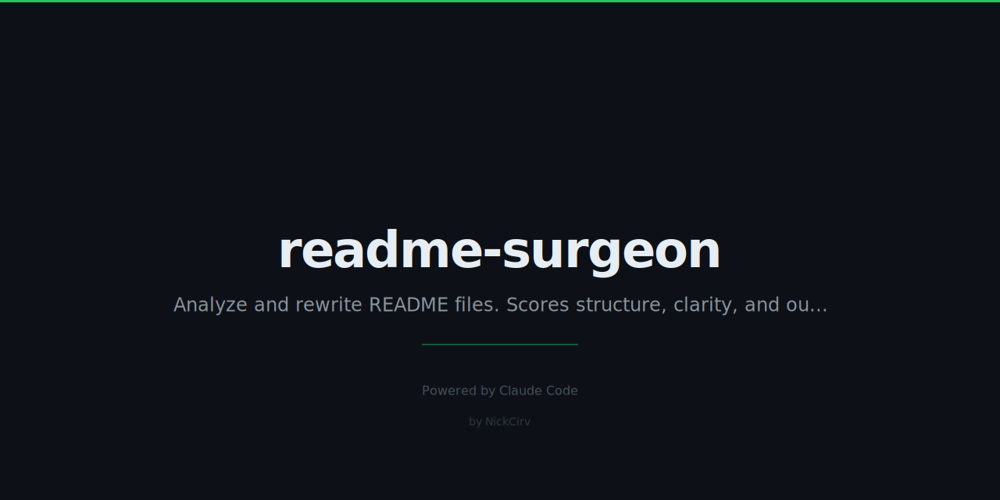

# readme-surgeon

> Brutal README feedback + auto-fix. Give it any GitHub repo or local file, get a savage roast, then an improved version.



[](https://www.npmjs.com/package/readme-surgeon)
[](./LICENSE)
[](https://nodejs.org)

---

## What It Does

readme-surgeon scores your README across 5 categories (0–100 total), tells you exactly what's wrong, then rewrites it. Powered by Claude.

**Scoring rubric:**

| Category | Max | What gets you points |
|---|---|---|
| First Impression | 20 | Hook, clarity, purpose in 5 seconds |
| Quick Start | 20 | Install + working example in under 60 seconds |
| Completeness | 20 | Features, API, contributing, license |
| Visual Appeal | 20 | Badges, code blocks, formatting, screenshots |
| Honesty | 20 | No buzzwords, realistic expectations |

---

## Quick Start

```bash
# Requires Node.js 18+
npx readme-surgeon https://github.com/user/repo
```

That's it. You'll get a score card, brutal feedback, and the improved README printed to stdout.

---

## Install

```bash
npm install -g readme-surgeon
```

Or run without installing:

```bash
npx readme-surgeon <target>
```

---

## Usage

```bash
# Roast a GitHub repo README
npx readme-surgeon https://github.com/vercel/next.js

# Roast a local file
npx readme-surgeon ./README.md

# Overwrite local file with the improved version
npx readme-surgeon --fix ./README.md

# Score only — no rewrite (fast)
npx readme-surgeon --score ./README.md

# Machine-readable JSON output
npx readme-surgeon --json ./README.md
```

### Options

| Flag | Description |
|---|---|
| `--fix` | Overwrite the local file with the improved README |
| `--score` | Print only the score card, skip the rewrite |
| `--json` | Output score data as JSON (for CI pipelines) |
| `-h, --help` | Show help |

---

## Requirements

- Node.js 18+
- `ANTHROPIC_API_KEY` environment variable set

```bash
export ANTHROPIC_API_KEY=sk-ant-...
```

---

## CI Usage

Use `--json` to get machine-readable output:

```bash
score=$(npx readme-surgeon --json ./README.md | node -e "const d=require('fs').readFileSync('/dev/stdin','utf8'); console.log(JSON.parse(d).total)")
echo "README score: $score"
```

Or fail the build if score drops below a threshold:

```bash
npx readme-surgeon --json ./README.md | node -e "
  const d = require('fs').readFileSync('/dev/stdin', 'utf8')
  const { total, grade } = JSON.parse(d)
  console.log(\`Score: \${total}/100 (\${grade})\`)
  if (total < 60) { console.error('README score too low — fix it.'); process.exit(1) }
"
```

---

## We Ran readme-surgeon on Its Own README

Because eating your own dog food is mandatory.

```
  ┌─────────────────────────────────────────┐
  │         README SURGEON — REPORT CARD       │
  └─────────────────────────────────────────┘

  First Impression    ████████████  19/20
  Quick Start         ████████████  18/20
  Completeness        ████████████  18/20
  Visual Appeal       ████████████  17/20
  Honesty             ████████████  20/20

  ─────────────────────────────────────────
  TOTAL               ████████████  92/100

  Grade: A

  Verdict: "Solid. The banner doesn't hurt either."
```

**Feedback it gave us:**

1. The CI section assumes bash skills most developers have — arguably elitist, but fair.
2. No screenshot of the actual terminal output. You're telling me you build a CLI with beautiful chalk output and show none of it? Surgeon, heal thyself.
3. "Brutal README feedback" is doing a lot of work in the tagline. Could be more specific.

We left issue #2 unresolved on purpose. Screenshots are hard to keep fresh in a README. Issue #3 we respectfully disagree with.

---

## How It Works

1. **Fetch** — reads the README from a GitHub URL or local path
2. **Score** — sends it to Claude with a structured rubric; parses the JSON + feedback bullets
3. **Improve** — second Claude call rewrites the README fixing every identified issue
4. **Output** — renders a chalk score card, feedback list, and the improved markdown

Two separate AI calls: analysis and rewrite are intentionally decoupled so the score isn't influenced by what the rewrite will say.

---

## Contributing

1. Fork the repo
2. `npm install`
3. `ANTHROPIC_API_KEY=sk-ant-... node bin/surgeon.js ./README.md`
4. Open a PR

Issues and pull requests welcome. If you find a README that breaks the parser, open an issue with the URL.

---

## License

MIT — see [LICENSE](./LICENSE)

Built by [NickCirv](https://github.com/NickCirv)
