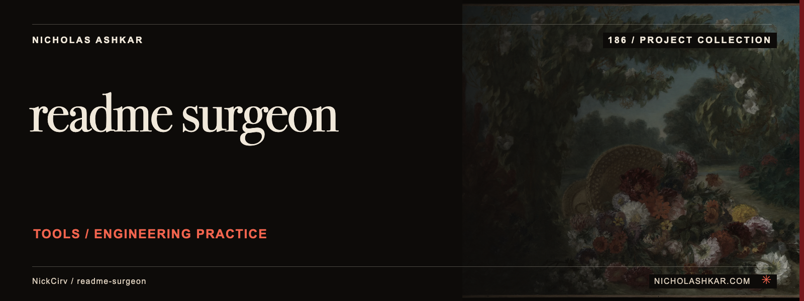

# readme-surgeon

Ask an Anthropic model to critique and rewrite a local or public GitHub README.

Fetches the requested README, requests a structured score and optionally generates a replacement draft. Score-only and JSON modes support a narrower review.


<a id="install"></a>

## Quickstart

Package runtime requirement: Node.js `>=20`. Git is needed to obtain this pinned source checkout.

```bash
git clone https://github.com/NickCirv/readme-surgeon.git
cd readme-surgeon
git checkout 8f645ec4416f48616fa287127fc726aeb10a866d
npm install --ignore-scripts
node bin/surgeon.js --help
```

This source-derived example has not been executed in this review. Help does not call the API. All scoring/generation requires `ANTHROPIC_API_KEY`.


<a id="what-it-does"></a>

## Usage

```bash
node bin/surgeon.js ./README.md --score
node bin/surgeon.js ./README.md --json
node bin/surgeon.js https://github.com/NickCirv/readme-surgeon
```

The normal mode prints a proposed rewrite. `--fix` directly overwrites a local file; URL targets reject that option.

[Command reference](docs/REFERENCE.md) covers arguments, modes and output controls.

## Behavior and limits

The model receives README text, not a verified source-code evidence pack. It can introduce unsupported capabilities, installation instructions or claims. `--fix` does not create a documented backup, so review a draft before replacing a file. GitHub fetching tries known README/branch conventions and is not a complete documentation crawler.

## Development

Declared package scripts:

| Script | Command |
| --- | --- |
| `test` | `node --test` |
| `start` | `node bin/surgeon.js` |
| `lint` | `node --check src/*.js bin/surgeon.js` |

The smoke test syntax-checks the entrypoint; it does not exercise CLI behavior or integrations.

## Research

[Source review and claim ledger](docs/RESEARCH.md) records revision `8f645ec4416f`, inspected files and verification gaps.

## License and attribution

Protected license and attribution files remain unchanged: [LICENSE](https://github.com/NickCirv/readme-surgeon/blob/8f645ec4416f48616fa287127fc726aeb10a866d/LICENSE).

[Artwork credits](assets/nicholas-ashkar/CREDITS.md) · [Nicholas Ashkar — consulting](https://nicholashkar.com/#oxblood-contact)
